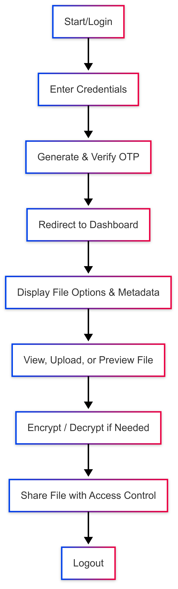

# 🔐 Secure File Management System

**Course: Operating Systems**

## 👥 Team Members

- Kiran Kumari - 12303370 (Roll No: 28)  
  Student, Computer Science and Engineering

- Aditya Hans - 12308188 (Roll No: 29)  
  Student, Computer Science and Engineering

- Anurag Singh Parmar - 12307717 (Roll No: 30)  
  Student, Computer Science and Engineering

---

## 1. Project Overview

The Secure File Management System (SFMS) is an online system that is planned to provide secure, effective, and easy-to-use file management. The central aim is to safeguard user information with secure authentication, access control, encryption, and intelligent threat detection. It offers an interface by which users can upload, preview, share, and organize their files securely in a sealed digital space.

Some of the central aims of the project are:

- Offering safe file storage with user-centric access rights
- Including OTP-based login for improved authentication
- Providing file preview feature for content types (.txt, .pdf, .docx, .jpg, etc.)
- Secure exchange of files with dedicated users with access control
- Providing confidentiality of files through encryption and integrity through metadata logging
- Threat detection and logging operations for improved surveillance

The system is built on PHP for backend functionalities, with frontend support through HTML/CSS/JavaScript. File data is securely stored and actions are tracked to ensure transparency.

The project seeks to be beneficial to user individuals, institutions, and organizations by offering a secure online space whereby one can effectively manage files with less risk induced by unauthorized access, data intrusion, or viruses.

---

## 2. Module-Wise Breakdown

Secure File Management System (SFMS) is designed into three major modules that together provide secure and efficient file operations within the application.

### 1. Authentication & Access Control Module
- Controls user identity and access privileges
- Includes secure login through user credentials and OTP-based verification for added security
- Implements role-based access control (e.g., Admins and General Users) to limit access based on user roles
- Manages session verification and logout functions to ensure data confidentiality

### 2. File Handling & Management Module
- Core functionality module of the system
- Supports file upload, preview, and deletion
- Compatible with file formats: .txt, .pdf, .jpg, and .docx
- Displays metadata including file size, creation date, and owner information
- Ensures file security through encryption during both storage and retrieval
- Maintains data integrity and privacy

### 3. File Sharing & Threat Detection Module
- Allows users to securely share files via temporary links or user-specific permissions
- Includes basic threat detection to scan for malicious content
- Alerts users to abnormal file behaviour
- Maintains logs of user actions to enhance accountability

---

## 3. Functionalities

The Secure File Management System provides the following principal functionalities:

- OTP-Based Authentication: Secure user login through one-time passwords received via email for maximum security
- File Upload & Storage: Users can upload files of different types, stored securely in user-specific directories
- File Preview: Preview within the browser for files of supported types like PDF, DOCX, TXT, and images
- Metadata Display: Displays details of the file such as name, size, type, and upload date
- File Sharing: Exchange files with other registered users while managing access rights
- Threat Detection & Logging: Recognizes inappropriate activity and keeps logs for audit trails

---

## 4. Technology Used

- Programming Languages: PHP, HTML, CSS, JavaScript
- Libraries and Tools: PHPMailer, Bootstrap, jQuery, PDF.js, Docx.js, Fileinfo (PHP Extension)
- Other Tools: GitHub, XAMPP/WAMP, MySQL, VS Code

---

## 5. Flow Diagram

---

## 6. Revision Tracking on GitHub

- Repository Name: Secure-File-Management-System
- GitHub Link: [https://github.com/AnuragSinghParmar/Secure-File-Management-System](https://github.com/AnuragSinghParmar/Secure-File-Management-System)

---

## 7. Conclusion and Future Scope

The Secure File Management System effectively meets the fundamental file security, privacy, and optimal access control in the digital world. Through the implementation of notable features such as login validation with OTP, file preview, file sharing, and metadata analysis, the system ensures total user control over data. All modules function in harmony to provide an end-to-end user-friendly experience while upholding strong backend security measures.

The addition of encryption features and real-time threat detection also adds to the credibility and timeliness of the platform in today's cybersecurity environment.

This project not only provides an operational prototype of safe file storage and sharing but also lays the foundation for future development. In the future, the system can be augmented with features such as end-to-end file encryption, threat prediction through AI, real-time collaboration features, and integration with clouds for distributed storage. Furthermore, creating mobile-friendly editions and integrating multi-factor authentication (MFA) could further increase accessibility and security.

With changing online threats and heightened data sensitivity, the Secure File Management System presents high potential for use in organizations, schools, and individual use scenarios. Continued growth and application in the field will enable the project to scale and evolve, eventually making the digital world safer.

---

## 8. References

- Stallings, W. (2018). Operating Systems: Internals and Design Principles (9th ed.). Pearson Education.
- Tanenbaum, A. S., & Bos, H. (2015). Modern Operating Systems (4th ed.). Pearson Education.
- Web-based Authentication Methods for Securing Online Transactions, IEEE Transactions on Cybersecurity, 2017.
- [GitHub Documentation - Version Control and Collaboration](https://docs.github.com/en/github)
- [PHP Documentation](https://www.php.net/docs.php)

---

> 📌 *For full functionality, clone the repo and run it on XAMPP/WAMP. Ensure all libraries and dependencies are installed.*
